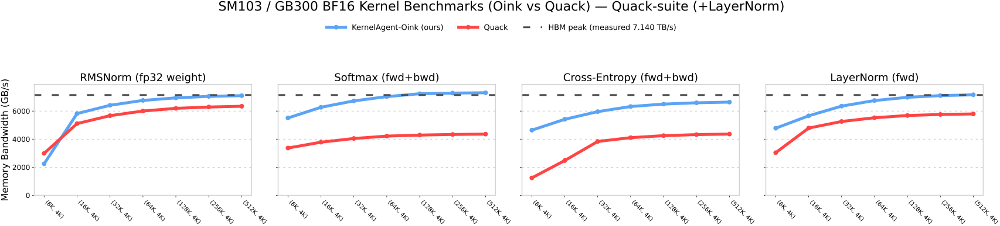

# KernelAgent-Oink

KernelAgent-Oink is a lightweight **CuTeDSL (CUTLASS DSL) kernel package** for
NVIDIA Blackwell **SM10x** GPUs. It can be used standalone or loaded as a
**vLLM general plugin**.

Current custom ops:

- `torch.ops.oink.rmsnorm(x, weight, eps) -> Tensor`
- `torch.ops.oink.fused_add_rms_norm(x, residual, weight, eps) -> None` (in-place)
- `torch.ops.oink.gemm(mat_a, mat_b, out_dtype=None) -> Tensor`
- `torch.ops.oink.gemm_out(mat_a, mat_b, out) -> None` (caller-owned output)
- `torch.ops.oink.grouped_mm(mat_a, mat_b, offs, scenario="2Dx3D", out_dtype=None) -> Tensor`

The repo also contains benchmark-facing Blackwell kernels for LayerNorm, Softmax,
CrossEntropy, dense GEMM, and MoE grouped GEMM.

## Requirements

- Blackwell GPU for optimized CuTeDSL paths; other GPUs use correctness-first
  PyTorch fallbacks.
- `nvidia-cutlass-dsl>=4.4.2` for existing Oink kernels; optimized dense GEMM and CUTLASS 4.5-style MoE grouped-GEMM backends require `nvidia-cutlass-dsl>=4.5.0`.
- `cuda-python`
- `torch` from the surrounding environment / vLLM

Recommended env vars:

```bash
export PYTORCH_ALLOC_CONF=expandable_segments:True
export CUTE_DSL_ARCH=sm_103a   # GB300 / SM103 (required by GEMM/tcgen05 paths)
# export CUTE_DSL_ARCH=sm_100a # GB200/B200 / SM100
```

## Install

From the `KernelAgent` repo root:

```bash
pip install -e ./oink
pip install -e "./oink[bench]"  # optional benchmark/plot deps
```

A reproducible GB300 benchmark environment used for the results below:

```bash
conda create -y -n cute python=3.12
conda run -n cute python -m pip install --upgrade pip setuptools wheel packaging ninja
conda run -n cute python -m pip install --upgrade --index-url https://download.pytorch.org/whl/cu130 torch
conda run -n cute python -m pip install 'nvidia-cutlass-dsl==4.5.0' cuda-python triton matplotlib
# Oink GEMM paths use CUTLASS DSL 4.5-style Blackwell/tcgen05 helpers.
conda run -n cute python -m pip install -e './oink[bench]'
```

## Usage

### vLLM plugin

```bash
export VLLM_USE_OINK_RMSNORM=1
```

When using `torch.compile` / CUDA graphs, keep vLLM RMSNorm as a custom op:

```python
from vllm import LLM

llm = LLM(
    model=...,
    tensor_parallel_size=...,
    enforce_eager=False,
    compilation_config={"custom_ops": ["none", "+rms_norm"]},
)
```

### Direct PyTorch

```python
import kernelagent_oink
import torch

kernelagent_oink.register(force=True)

x = torch.randn(1024, 4096, device="cuda", dtype=torch.bfloat16)
w = torch.randn(4096, device="cuda", dtype=torch.bfloat16)
y = torch.ops.oink.rmsnorm(x, w, 1e-6)

# Dense BF16 GEMM:
a_dense = torch.randn(4096, 4096, device="cuda", dtype=torch.bfloat16)
b_dense = torch.randn(4096, 4096, device="cuda", dtype=torch.bfloat16)
out_dense = torch.ops.oink.gemm(a_dense, b_dense, torch.bfloat16)
out_dense_prealloc = torch.empty((4096, 4096), device="cuda", dtype=torch.bfloat16)
torch.ops.oink.gemm_out(a_dense, b_dense, out_dense_prealloc)

# MoE forward-style grouped GEMM (2Dx3D):
a = torch.randn(128, 4096, device="cuda", dtype=torch.bfloat16)
b = torch.randn(8, 4096, 8192, device="cuda", dtype=torch.bfloat16)
offs = torch.arange(16, 129, 16, device="cuda", dtype=torch.int32)
out = torch.ops.oink.grouped_mm(a, b, offs, "2Dx3D", torch.bfloat16)
```

`grouped_mm` follows `torch.nn.functional.grouped_mm` semantics for `2Dx3D`
forward-style MoE and `2Dx2D` weight-gradient-style layouts. In environments
with `nvidia-cutlass-dsl<4.5.0`, Oink intentionally uses Torch/reference fallback
semantics because the CUTLASS 4.5 expert-wise TMA descriptor path is not
legalizable by the 4.4.x DSL stack.

## Benchmarks

Benchmark details and commands are in [`benchmarks/README.md`](benchmarks/README.md).
Reported numbers are correctness-gated against PyTorch references before timing.

Current GB300 / SM103 setup:

- NVIDIA GB300, capability `(10, 3)`, `CUTE_DSL_ARCH=sm_103a` for GEMM/tcgen05 paths
- `torch==2.11.0+cu130`, CUDA `13.0`
- `nvidia-cutlass-dsl==4.5.0`, `cuda-python==13.2.0`
- measured BF16 STREAM-like roof: **7.140 TB/s**

<div align="center">
  
</div>

Quack-suite BF16 summary (`N=4096`):

| op | rows | geomean vs Quack | large-row roofline note |
|---|---:|---:|---|
| RMSNorm fwd, weight=same | 19 | 1.019x | near measured roof on large rows |
| RMSNorm fwd, weight=fp32 | 19 | 1.100x | near measured roof on large rows |
| LayerNorm fwd | 19 | 1.241x | near measured roof on large rows |
| Softmax fwd+bwd | 19 | 1.673x | near measured roof on large rows |
| CrossEntropy fwd+bwd | 19 | 1.635x | mixed memory/SFU behavior |

Historical plots remain under `benchmarks/media/`:

- `sm100_*`: historical SM100 / B200 runs.
- `gb300_bf16_qk_norm_oink_vs_cutedsl_roofline.svg`: historical GB300 Q/K-norm
  harness, separate from the Quack-suite table above.

### GB300 (SM103) LayerNorm backward results

Oink's LayerNorm backward path is self-contained in this repo. The OSS
benchmark reports Oink against ATen's native LayerNorm backward reference.

Measured on **GB300 (SM103)** in the `cute` Conda environment with torch
`2.11.0+cu130`, CUDA `13.0`, and `CUTE_DSL_ARCH=sm_103`, using CUDA graph warm
replay (`--cuda-graph`), bf16 activations/gradients, same-dtype LayerNorm
weights, and no bias. Correctness was checked before timing against a chunked
fp32 PyTorch formula for `dx` / `dweight`; the timed `ref` column uses
`torch.ops.aten.native_layer_norm_backward.default` with the same precomputed
`mean` and `rstd`.

The OSS Quack package installed in this environment exposes LayerNorm forward but
not a `quack.rmsnorm.layernorm_bwd` API, so the benchmark reports Quack as
unavailable and omits Quack timing columns. If a Quack build with
`layernorm_bwd` is installed, the same command will add `quack_ms` and
`Oink/Quack` columns.

The throughput columns use a logical useful-IO model for no-bias LayerNorm
backward: read `x`, read `dout`, write `dx`, read/write `weight`/`dweight`, and
read fp32 `mean` + `rstd`. This excludes implementation-specific scratch traffic,
so the values are a useful-bandwidth roofline view rather than physical HBM bytes.
Full DSv3/DSv4 tables are in [`benchmarks/README.md`](benchmarks/README.md).


Reproduce with:

```bash
env PYTHONNOUSERSITE=1 CUTE_DSL_ARCH=sm_103 PYTORCH_ALLOC_CONF=expandable_segments:True \
  conda run -n cute python -u oink/benchmarks/benchmark/benchmark_layernorm_bwd_sm100.py \
    --dtype bf16 --weight-dtype same --dsv4 --iters 80 --warmup-ms 10 --cuda-graph \
    --json /tmp/oink_layernorm_bwd_sm103_dsv4_cuda_graph_seq.json
```

## Links

| What | Link |
|---|---|
| Quack baseline | https://github.com/Dao-AILab/quack |
| KernelAgent | https://github.com/meta-pytorch/KernelAgent |
| vLLM Oink RMSNorm PR | https://github.com/vllm-project/vllm/pull/31828 |
